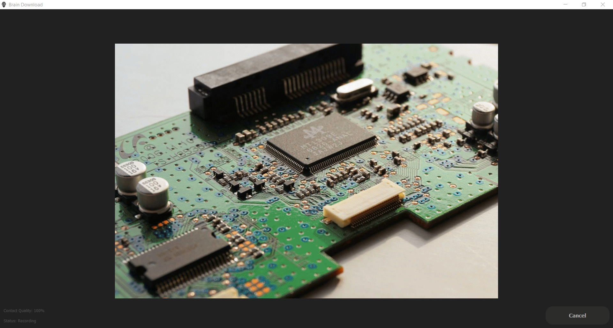
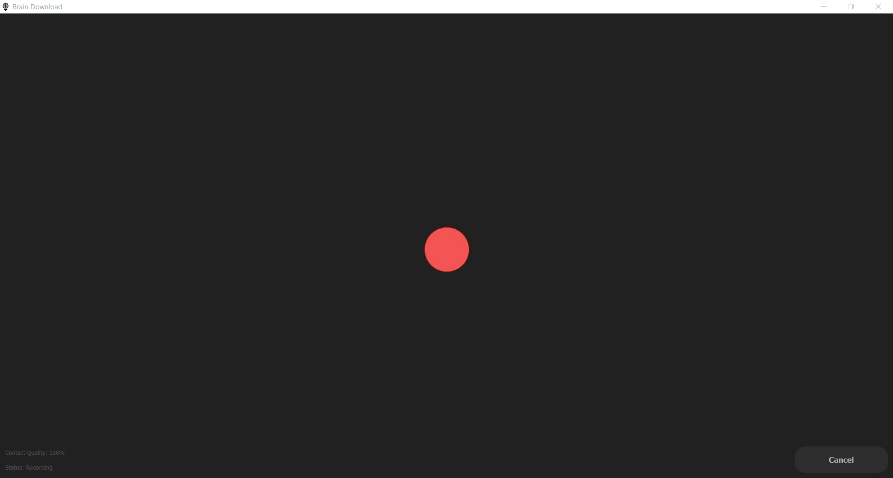
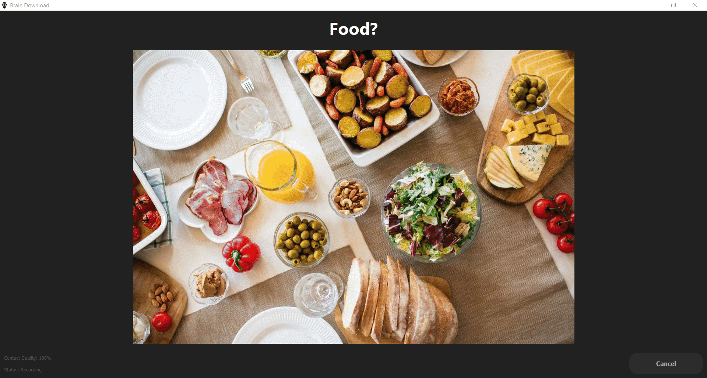

# Brain-Download-Datasets

## Dataset
The dataset contain EEG signals recorded from EMOTIV Insight 5-Cannel headset of four different experiments. All the following experiments except for *Baseline* were conducted by visually stimulating the subject's brain with a random image presentation. The image sequencing was done using the [Brain Download](https://github.com/LKbrilliant/Brain-Download) software. 

1. **Baseline**: EEG signals of calmed mind with eyes opened and closed.
2. **Image-Blank**: Simulated thinking “something” and “nothing” on the subject’s brain by randomly presenting images and blank screens.

  

3. **Left-Right_Arrows**: Showed left and right directed arrows on the left and right edges of the screen respectively and the subject was instructed to directly look at them without moving the head. Since the image sequence is randomized, a reference mark was presented at the center of the screen after each arrow image.

4. **Visual_Q&A**: Simultaneously displayed a yes-no question about the presented image and instructed the subject to think about the answer.

## Scripts
- After extracting the `.zip` files in the Dataset directory, you can plot a random record (.csv file) using `plot_random_full.py`.
- You can split the records (.csv files) into smaller chunks of watching one stimulus by using the `splitter.py` script. The separated chunks and their labels will be saved as `.npy` files. 
- You can plot some random chunks in a saved `.npy` data file by using the `plot_random_split.py`.

## Experiment Details (WIP)